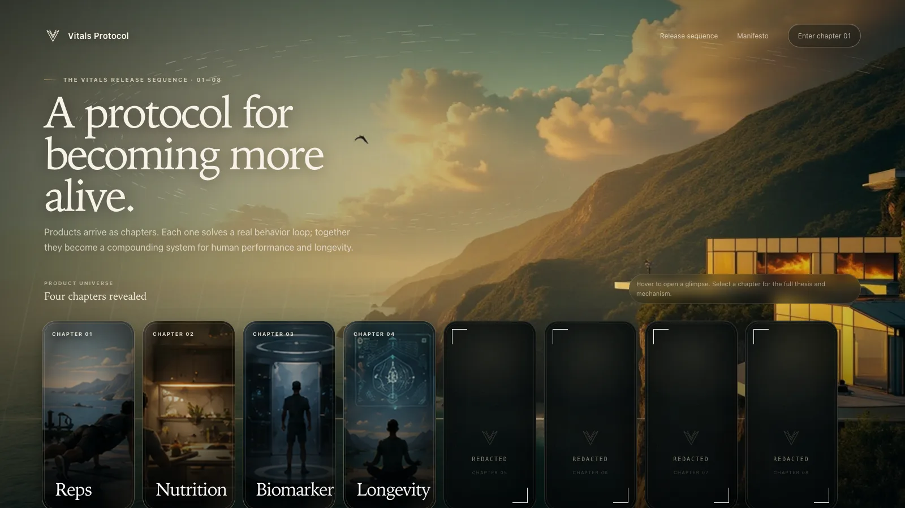

# Vitals Protocol — cinematic release sequence

A working chapter-based landing page built from the approved visual direction.




## What is included

- Full-screen cinematic background using the generated coastal compound artwork.
- Slow background drift, pointer parallax, ocean shimmer, and a procedural canvas vortex.
- Four revealed chapter cards and three redacted cards.
- Gentle card expansion on hover/focus.
- App, Thesis, Mechanism, and Roadmap glimpses inside the expanded card.
- Click-through chapter dialog with tabbed product narrative.
- Image **or looping MP4** support for every chapter.
- Responsive desktop and mobile behavior.
- Reduced-motion accessibility support.
- A Next.js App Router implementation plus a dependency-free static preview.

## Run the static preview immediately

No install is required:

```bash
npm run preview:static
```

Then open:

```text
http://localhost:4173/preview/
```

You can also run it with Python:

```bash
python3 -m http.server 4173
```

and open `/preview/`.

## Run the Next.js site

```bash
npm install
npm run dev
```

Open `http://localhost:3000`.

## Deploy to Cloudflare (Workers Static Assets)

The site builds to a fully static export in `out/` (`next.config.mjs` sets
`output: "export"`), so it deploys to Cloudflare with no server runtime.

```bash
npm run deploy
```

This runs `next build` and then `wrangler deploy`, publishing `out/` as a
Cloudflare Worker with static assets (see `wrangler.jsonc`). First run will
prompt for `wrangler login`.

To test the production Worker locally:

```bash
npm run preview:worker
```

Cloudflare Pages also works: connect the repo, use build command
`npm run build` and output directory `out`.

## Replace chapter artwork or add video

All content and media are controlled in:

```text
data/chapters.ts
```

For an image:

```ts
media: {
  type: "image",
  src: "/vitals/chapter-reps.webp",
  alt: "Reps product scene",
  position: "50% 54%",
}
```

For a looping chapter video:

```ts
media: {
  type: "video",
  src: "/vitals/videos/reps-loop.mp4",
  poster: "/vitals/chapter-reps.webp",
  alt: "Reps product animation",
  position: "50% 50%",
}
```

Place replacement files inside `public/vitals/`. The card and full chapter dialog will both use the new media automatically.

## Main files

```text
app/page.tsx                              Page entry
app/globals.css                           Complete visual system and responsive behavior
components/VitalsReleaseExperience.tsx    Cards, hover interaction, modal, parallax
components/AmbientVortex.tsx               Procedural animated background field
data/chapters.ts                          Replaceable chapter content and media
public/vitals/                             Background and chapter artwork
preview/                                   Standalone working HTML/CSS/JS version
```

## Integration notes

- Replace the placeholder “Follow this chapter” handler with the waitlist or product route.
- The first four chapter names and copy are intentionally centralized in `data/chapters.ts`.
- Add or remove redacted entries in the same array.
- The page uses no animation library, so it can be dropped into an existing Next.js codebase without adding Framer Motion.
- The background artwork contains the current Reps facility signage. Replace `public/vitals/coastal-compound.webp` whenever a neutral Vitals-only master background is ready.
